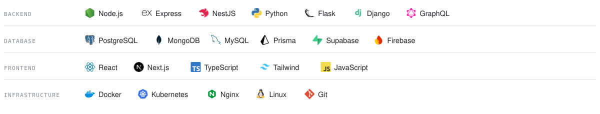
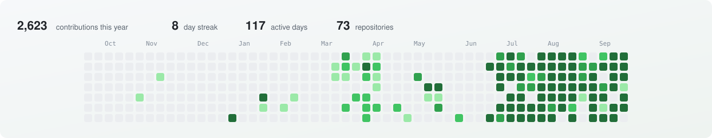
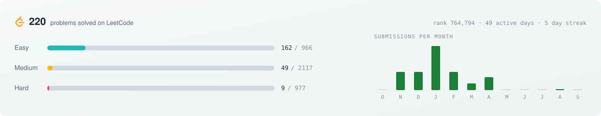

<a href="https://binyammamo.vercel.app"> Portfolio</a>&nbsp;&nbsp;&nbsp;<a href="https://www.linkedin.com/in/binyammamo"> LinkedIn</a>&nbsp;&nbsp;&nbsp;<a href="mailto:binyammamo01@gmail.com"> Email</a>&nbsp;&nbsp;&nbsp;<a href="https://wa.me/971568784063"> WhatsApp</a>&nbsp;&nbsp;&nbsp;<a href="https://leetcode.com/u/BIN_01"> LeetCode</a>

<b>Horan HMS</b> &nbsp;·&nbsp; Hotel management for Ethiopian hotels, with a Telegram assistant staff can ask by voice &nbsp;·&nbsp; <a href="https://binyammamo.vercel.app/projects/horan-hms">case study</a>

 

<b>Hakim Click</b> &nbsp;·&nbsp; Clinical answers drawn only from national treatment guidelines, each linked to its source page &nbsp;·&nbsp; <a href="https://hakim-web-zeta.vercel.app">hakim-web-zeta.vercel.app</a>

 

<b>Clixa Tools</b> &nbsp;·&nbsp; 63 clinical calculators, cancer staging and growth charts, offline and installable &nbsp;·&nbsp; <a href="https://clixa-tools.vercel.app">clixa-tools.vercel.app</a>

 

<b>Yakal Education</b> &nbsp;·&nbsp; Tutoring and college counselling, with a dashboard for every role involved &nbsp;·&nbsp; <a href="https://yakal.me">yakal.me</a>

 

<b>Soroban for Kids</b> &nbsp;·&nbsp; Abacus lessons for children, narrated in English and Amharic &nbsp;·&nbsp; <a href="https://soroban-kids.vercel.app">soroban-kids.vercel.app</a> · <a href="https://github.com/BinyamMamo/soroban">code</a>

 

<b>Solar Farm Drone</b> &nbsp;·&nbsp; A simulated drone that inspects an 80-table solar farm and lands itself &nbsp;·&nbsp; <a href="https://solar-farm-drone-replay.vercel.app">3D replay</a> · <a href="https://github.com/BinyamMamo/solar-farm-drone">code</a>

 

The cards are generated from live GitHub and LeetCode data by <a href="scripts/build-cards.mjs">a script</a> that runs here every day.
